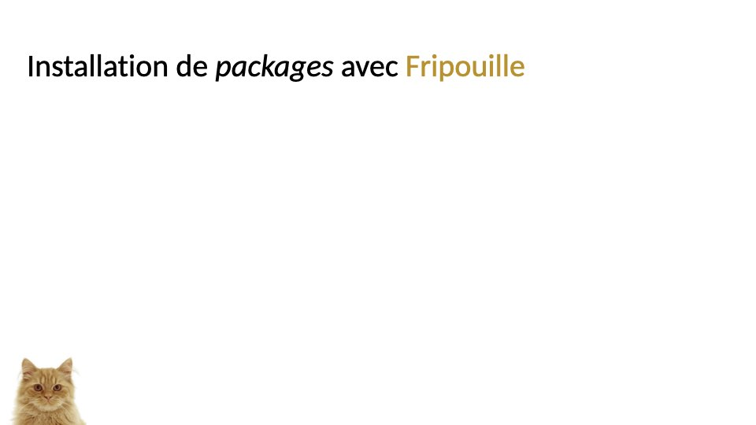
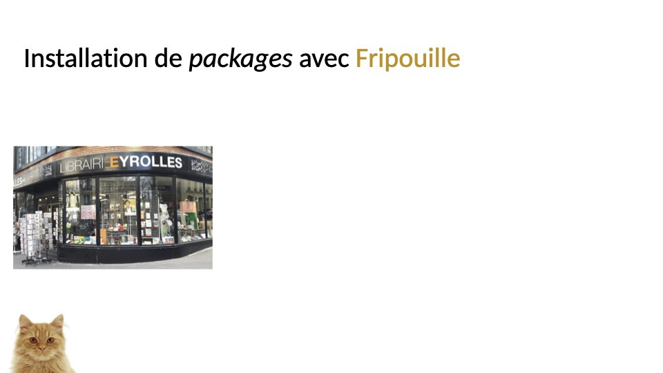
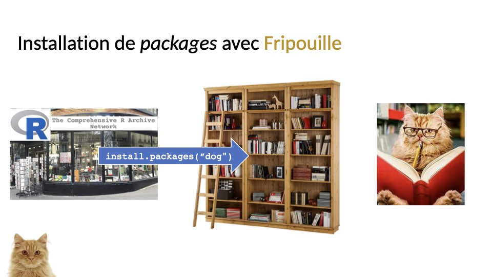

```{r setup, include = FALSE}
knitr::opts_chunk$set(
  collapse = TRUE,
  comment = "#>",
  echo = TRUE
)
```


## 

{width=100%}

## 

{width=100%}

## 

{width=100%}

## 

{width=100%}

## 

{width=100%}

## 

{width=100%}

## 

{width=100%}

## 

{width=100%}

## 

{width=100%}

## 

{width=100%}

## Comment installer des packages depuis... {.smaller}


  * Bioconductor ?
    1. Installer le package `BiocManager` depuis le CRAN
    2. Exécuter la commande `BiocManager::install("le_nom_du_package")`
  * GitHub ?
    1. Installer `devtools`
    2. Exécuter la commande `devtools::install_github("username/repository")`.
  * Du code source ?
    1. Mettre le `source.tar.gz` dans son dossier de travail...
    2. ou l'inverse.
    3. Exécuter la commande `install.package("source.tar.gz", repos = NULL, type = "source")`.

# Exercices

## Installez le package du cours

Dans le cadre de ce cours, j'ai créé un package R contenant :

 * les slides (`html`)
 * les données fruits (`csv`, `xlsx`, et `RData`)
 * des TDs interactifs (`html`)

Installez ce package avec la commande

```{r install, eval = FALSE}
remotes::install_github(
  "vguillemot/debuter",
  build_vignettes = TRUE
)
```

## Explorez la documentation du package

  1. Charger le package :  `library(debuter)`
  2. Regardez l'aide "générale" du package : \u0060`?debuter-package`\u0060
  3. Explorez la première vignette : `vignette("S00programme")`
  4. Accédez à la liste complète des vignettes : `browseVignettes("debuter")`, cette interface permet d'accéder au code source (R Markdown et R)...
  5. ... que vous pouvez également accéder avec la commande : `edit(vignette("S00programme"))`
  
# Les tutoriels !

Vous pouvez y accéder sur la page du site, mais ils sont aussi disponibles dans un onglet spécial si vous travaillez avec Rstudio > 1.3


